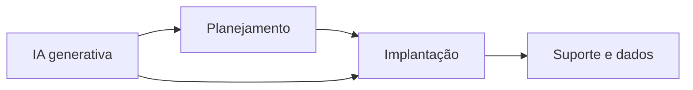

# Bruno Henrique Fernandes

**Gestor de Projetos de TI & Especialista em IA** · *IT Project Manager & AI Specialist*

*Consultoria · Infraestrutura · Inteligência Artificial aplicada ao negócio*

[%209%209113--3339-25D366?style=for-the-badge&logo=whatsapp&logoColor=white)](https://wa.me/5516991133339)

---

<strong>Atalhos</strong> — clique para abrir

- [Repositórios (por última atualização)](https://github.com/BrunoHF04?tab=repositories&q=&sort=updated)  
- [Página de contribuições / gráfico](https://github.com/BrunoHF04)  
- [Portfólio completo](https://brunohf04.github.io/Portfolio-Bruno_Fernandes/)  

---

## Sobre mim

Especialista em TI com experiência em **consultoria de projetos**, **infraestrutura** e **atendimento**. Trabalho com **IA generativa** para acelerar documentação, análises e automação. Atuo na **liderança de implantações de software** no setor notarial, com foco em integridade de dados, eficiência e inovação.

> **Foco agora:** implantações em produção, documentação e automação com IA, e **dados** (SQL Server, PostgreSQL, Firebird — performance, migração e recuperação).

<strong>Experiência profissional</strong> (clique para expandir)

| Período | Cargo | Empresa |
|--------|--------|---------|
| Jul 2020 — hoje | Consultor de Projetos · Analista Service Desk | **Siplan** |
| Out 2018 — Jul 2020 | Técnico em Informática | **Sperta Moto (Honda)** |

**Destaques:** cronogramas e implantação em cartórios · IA para documentação e scripts · SQL Server, PostgreSQL, Firebird · liderança de Service Desk e SLAs · gestão de TI multi-unidades.

---

## Stack & ferramentas

**IA & dados**  

**Infra & DevOps**  

**Bancos de dados**  

 

---

## Visão rápida

---

## Projetos em destaque

| Projeto | Foco | Ver mais |
|--------|------|----------|
| **UnespPass** | Controle de acesso veicular (campus Unesp FCAV) | [Portfólio](https://brunohf04.github.io/Portfolio-Bruno_Fernandes/) |
| **Solicitações administrativas** | Gestão de demandas CS/CX | [Portfólio](https://brunohf04.github.io/Portfolio-Bruno_Fernandes/) |
| **Editor de flexões automatizado** | NLP · automação em Python | [Portfólio](https://brunohf04.github.io/Portfolio-Bruno_Fernandes/) |
| **Gestão de banco de horas** | PHP/SQL · dashboards | [Portfólio](https://brunohf04.github.io/Portfolio-Bruno_Fernandes/) |
| **Racionamento inteligente** | Hardware · Arduino · premiação CONIC-SEMESP | [Portfólio](https://brunohf04.github.io/Portfolio-Bruno_Fernandes/) |

> Todos os detalhes, depoimentos e formação estão no site: **[brunohf04.github.io/Portfolio-Bruno_Fernandes](https://brunohf04.github.io/Portfolio-Bruno_Fernandes/)**

---

## Formação & certificações

<strong>Formação acadêmica</strong>

- MBA em Gestão de Projetos de TI  
- Pós em Ciência de Dados & Big Data  
- Pós em Administração de Banco de Dados  
- Sistemas de Informação — Faculdade de Educação São Luís (2018)  
- Técnico em Informática — ETEC (2013)  

<strong>Certificações & cursos</strong>

- IA Generativa — Google Cloud / Coursera  
- Segurança da Informação — Cisco Networking Academy  
- Fundamentos de Cloud — Microsoft Azure (AZ-900)  
- Metodologias ágeis (Scrum) — PMI  

---

<strong>English version</strong> — click to expand

### About me

IT specialist with experience in **project consulting**, **infrastructure**, and **support**. I apply **generative AI** to accelerate documentation, analysis, and automation. I **lead software rollouts** in the notarial sector, focusing on data integrity, efficiency, and innovation.

> **Current focus:** production rollouts, AI-assisted documentation and automation, and **data work** (SQL Server, PostgreSQL, Firebird — performance, migration, and recovery).

<strong>Professional experience</strong>

| Period | Role | Company |
|--------|------|---------|
| Jul 2020 — present | Project Consultant · Service Desk Analyst | **Siplan** |
| Oct 2018 — Jul 2020 | IT Technician | **Sperta Moto (Honda)** |

**Highlights:** rollout planning for notary offices · AI for documentation and scripts · SQL Server, PostgreSQL, Firebird · Service Desk leadership and SLAs · multi-site IT management.

### Tech stack

Same toolkit as above — **AI & data** (Python, Google Cloud, Vertex AI), **Infra & DevOps** (Docker, Nginx, Linux/Ubuntu, PowerShell), and **databases** (SQL Server, PostgreSQL, Firebird). Icon strip in the Portuguese section above.

### Featured projects

| Project | Focus | More |
|---------|-------|------|
| **UnespPass** | Vehicle access control (Unesp FCAV campus) | [Portfolio](https://brunohf04.github.io/Portfolio-Bruno_Fernandes/) |
| **Administrative requests** | CS/CX demand workflow | [Portfolio](https://brunohf04.github.io/Portfolio-Bruno_Fernandes/) |
| **Automated inflection editor** | NLP · Python automation | [Portfolio](https://brunohf04.github.io/Portfolio-Bruno_Fernandes/) |
| **Overtime bank management** | PHP/SQL · dashboards | [Portfolio](https://brunohf04.github.io/Portfolio-Bruno_Fernandes/) |
| **Smart rationing monitor** | Hardware · Arduino · CONIC-SEMESP award | [Portfolio](https://brunohf04.github.io/Portfolio-Bruno_Fernandes/) |

Full case details, testimonials, and education: **[brunohf04.github.io/Portfolio-Bruno_Fernandes](https://brunohf04.github.io/Portfolio-Bruno_Fernandes/)**

<strong>Education</strong>

- MBA in IT Project Management  
- Postgraduate in Data Science & Big Data  
- Postgraduate in Database Administration  
- Information Systems — Faculdade de Educação São Luís (2018)  
- IT Technician — ETEC (2013)  

<strong>Certifications & courses</strong>

- Generative AI — Google Cloud / Coursera  
- Information Security — Cisco Networking Academy  
- Cloud fundamentals — Microsoft Azure (AZ-900)  
- Agile methods (Scrum) — PMI  

### Let’s talk

Open to **IT projects**, **consulting**, and **collaborations** where AI and solid processes drive impact.

---

## GitHub em números

Badges via [Shields.io](https://shields.io) e sequência de contribuições ([streak-stats](https://github.com/DenverCoder1/github-readme-streak-stats)) — evitamos o *github-readme-stats* público na Vercel, que costuma falhar.

<strong>English</strong> — same metrics, English labels

---

## Vamos conversar?

Aberto a **projetos de TI**, **consultoria** e **colaborações** onde IA e processos possam gerar impacto.

*PT · EN — atualizado conforme o portfólio, 2026*

---

## Cobra nas contribuições

GIF + SVG em <code>assets/</code> — workflow <a href="https://github.com/BrunoHF04/BrunoHF04/blob/main/.github/workflows/snake.yml"><code>snake.yml</code></a> (Docker <a href="https://github.com/Platane/snk">Platane/snk</a>). Só contribuições <strong>públicas</strong>. <a href="https://github.com/BrunoHF04/BrunoHF04/blob/main/assets/github-contribution-grid-snake.svg">Abrir SVG</a> · Perfil: <a href="https://github.com/BrunoHF04">github.com/BrunoHF04</a>

